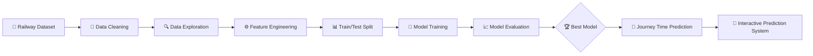

# 🚆 ML-Based Train Journey Time Prediction System

<p align="center">
  
  
  
  
</p>

<p align="center">
  <b>🚄 Predict. Analyze. Optimize. Travel Smarter.</b>
</p>

<p align="center">
  An intelligent machine learning system designed to predict train journey duration using historical railway data, route information, stops, and journey-related features.
</p>

---

## 🌌 Project Overview

Imagine a railway system that can estimate a train's journey duration **before the journey begins**.

This project uses **Machine Learning and Data Analytics** to analyze historical train journey information and build predictive models capable of estimating travel time.

The system follows a complete ML pipeline:

```text
📊 Raw Railway Data
       ↓
🧹 Data Cleaning
       ↓
🔍 Exploratory Data Analysis
       ↓
⚙️ Feature Engineering
       ↓
🤖 ML Model Training
       ↓
📈 Model Comparison
       ↓
🎯 Journey Time Prediction
```

The goal is to transform railway data into a practical **AI-powered prediction system**.

---

## ✨ Key Features

### 🚄 Journey Time Prediction

Predict the estimated duration of a train journey using machine learning.

### 🧹 Intelligent Data Cleaning

Handles:

* Missing values
* Duplicate records
* Incorrect data formats
* Inconsistent values
* Invalid journey information

### 📊 Data Analysis

The project analyzes important factors such as:

* Distance
* Number of stops
* Departure time
* Arrival time
* Route information
* Journey duration

### 🤖 Machine Learning

Multiple machine learning models can be trained and compared to identify the most suitable prediction algorithm.

### 📈 Model Evaluation

Models are evaluated using standard regression metrics such as:

* MAE
* MSE
* RMSE
* R² Score

### 🎯 Interactive Prediction

The final system allows users to enter journey information and receive a predicted travel duration.

---

# 🧠 Machine Learning Workflow



---

# 🏗️ Project Architecture

```text
                    🚆 TRAIN JOURNEY DATA
                             │
                             ▼
                    ┌─────────────────┐
                    │  DATA INGESTION │
                    └────────┬────────┘
                             │
                             ▼
                    ┌─────────────────┐
                    │ DATA CLEANING   │
                    │ & PREPROCESSING │
                    └────────┬────────┘
                             │
                             ▼
                    ┌─────────────────┐
                    │ FEATURE         │
                    │ ENGINEERING     │
                    └────────┬────────┘
                             │
                             ▼
                    ┌─────────────────┐
                    │ ML MODEL        │
                    │ TRAINING        │
                    └────────┬────────┘
                             │
                             ▼
                    ┌─────────────────┐
                    │ MODEL           │
                    │ COMPARISON      │
                    └────────┬────────┘
                             │
                             ▼
                    ┌─────────────────┐
                    │ BEST MODEL      │
                    └────────┬────────┘
                             │
                             ▼
                    ┌─────────────────┐
                    │ 🎯 PREDICTION   │
                    │ SYSTEM          │
                    └─────────────────┘
```

---

# 📂 Project Structure

```text
Sysslan_ML_Internship_Project/
│
├── 📁 data/
│   ├── train_dataset.csv
│   └── cleaned_train_dataset.csv
│
├── 📁 documentation/
│   └── intern_complete_task_explanation.md
│
├── 📁 scripts/
│   ├── level1_data_understanding.py
│   ├── level2_data_cleaning.py
│   ├── level3_feature_analysis.py
│   ├── level4_5_model_training_comparison.py
│   └── level6_interactive_prediction_system.py
│
└── 📄 README.md
```

---

# 🛠️ Technology Stack

| Technology      | Purpose                         |
| --------------- | ------------------------------- |
| 🐍 Python       | Core programming language       |
| 🧠 Scikit-learn | Machine Learning                |
| 📊 Pandas       | Data processing                 |
| 🔢 NumPy        | Numerical computing             |
| 📈 Matplotlib   | Data visualization              |
| 🎨 Seaborn      | Statistical visualization       |
| 💻 VS Code      | Development environment         |
| 🐙 GitHub       | Version control & collaboration |

---

# 🔬 Project Levels

## Level 1 — Data Understanding

The raw railway dataset is explored to understand:

* Dataset structure
* Data types
* Missing values
* Statistical properties
* Feature relationships

---

## Level 2 — Data Cleaning

The dataset is prepared for machine learning by handling:

```text
Missing Data
     ↓
Duplicate Records
     ↓
Invalid Values
     ↓
Data Type Conversion
     ↓
Clean Dataset
```

---

## Level 3 — Feature Analysis

Important variables are analyzed to identify relationships between journey characteristics and travel duration.

Example:

```text
Distance ──────────────┐
                      │
Number of Stops ──────┤
                      ├──► Journey Duration
Departure Time ───────┤
                      │
Route Information ────┘
```

---

# 🤖 Machine Learning Models

The project is designed to compare regression algorithms and determine which model provides the strongest prediction performance.

Potential models include:

* Linear Regression
* Decision Tree Regression
* Random Forest Regression
* Gradient Boosting Regression

The best-performing model is selected based on evaluation metrics.

---

# 📊 Model Evaluation

The system evaluates predictions using:

### Mean Absolute Error

Measures the average absolute difference between actual and predicted journey time.

### Mean Squared Error

Penalizes larger prediction errors.

### Root Mean Squared Error

Provides an interpretable measure of prediction error.

### R² Score

Measures how well the model explains variation in journey duration.

---

# 🎯 Example Prediction

```text
╔══════════════════════════════════════╗
║       🚆 JOURNEY PREDICTION          ║
╠══════════════════════════════════════╣
║ Distance        : 759 km             ║
║ Number of Stops : 4                  ║
║ Departure Time  : 06:00              ║
║                                      ║
║ ──────────────────────────────────── ║
║                                      ║
║ Predicted Journey Time               ║
║                                      ║
║        ⏱️  ~ 8 Hours                 ║
║                                      ║
╚══════════════════════════════════════╝
```

> **Note:** The displayed value is an example. Actual predictions depend on the trained model and input data.

---

# ⚡ How to Run

## 1️⃣ Clone the Repository

```bash
git clone https://github.com/mrravanan03-debug/Ai-projects.git
```

## 2️⃣ Navigate to the Project

```bash
cd Ai-projects/Sysslan_ML_Internship_Project
```

## 3️⃣ Install Dependencies

```bash
pip install pandas numpy scikit-learn matplotlib seaborn
```

## 4️⃣ Run the Data Understanding Script

```bash
python scripts/level1_data_understanding.py
```

## 5️⃣ Run Data Cleaning

```bash
python scripts/level2_data_cleaning.py
```

## 6️⃣ Run Feature Analysis

```bash
python scripts/level3_feature_analysis.py
```

## 7️⃣ Train & Compare Models

```bash
python scripts/level4_5_model_training_comparison.py
```

## 8️⃣ Run the Prediction System

```bash
python scripts/level6_interactive_prediction_system.py
```

---

# 🌐 Future Improvements

This project can be extended into a production-level railway intelligence platform.

### 🚀 Planned Enhancements

* [ ] Real-time train data integration
* [ ] Live railway API integration
* [ ] Weather-aware prediction
* [ ] Delay prediction
* [ ] Traffic-aware journey estimation
* [ ] Deep Learning models
* [ ] LSTM-based time-series prediction
* [ ] Interactive web dashboard
* [ ] Mobile application
* [ ] Cloud deployment
* [ ] Real-time monitoring
* [ ] Explainable AI

---

# 💡 Real-World Applications

This technology could potentially support:

🚆 **Railway Operations**

Estimate journey duration and improve operational planning.

👨‍✈️ **Train Management**

Support better scheduling and resource planning.

👥 **Passenger Information**

Provide estimated journey duration to passengers.

📊 **Railway Analytics**

Analyze historical transportation patterns.

🤖 **Smart Transportation**

Serve as a foundation for AI-powered transportation systems.

---

# 🎓 Learning Outcomes

Through this project, I developed practical experience in:

* Machine Learning
* Regression Analysis
* Data Cleaning
* Feature Engineering
* Exploratory Data Analysis
* Model Evaluation
* Python Programming
* Data Visualization
* Git & GitHub
* End-to-End ML Pipeline Development

---

# 👨‍💻 Developer

## **P. Ramanan**

🎓 B.Sc. Artificial Intelligence & Machine Learning
🏫 Kovai Kalaimagal College of Arts and Science
📍 Coimbatore, Tamil Nadu, India

### Areas of Interest

```text
🤖 Artificial Intelligence
🧠 Machine Learning
📊 Data Science
📈 Data Analytics
💻 Python Development
🌐 AI Applications
```

---

# 🏆 Internship Project

**Developed as part of Machine Learning Internship**

This project demonstrates the ability to take a machine learning problem from:

> **Raw Data → Analysis → Engineering → Modeling → Evaluation → Prediction**

---

# ⭐ Support

If you find this project interesting, consider giving the repository a ⭐.

<p align="center">
  <b>🚆 Turning Railway Data Into Intelligent Predictions 🚆</b>
</p>

<p align="center">
  Made with ❤️ using Python & Machine Learning
</p>
